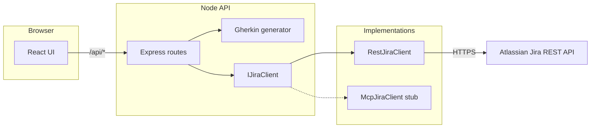

# Jira Story Builder

## Repository layout

```
toybox/
├── README.md
├── .env.example
├── package.json
├── vite.config.ts          # Dev proxy /api → :3001
├── index.html
├── server/
│   ├── index.ts            # Express bootstrap, Jira client wiring
│   ├── gherkin/
│   │   └── generateGherkin.ts
│   ├── jira/
│   │   ├── types.ts
│   │   ├── jiraClient.ts   # IJiraClient
│   │   ├── adf.ts          # Plain text → Atlassian Document Format
│   │   ├── restJiraClient.ts
│   │   ├── mcpJiraClient.ts
│   │   └── factory.ts
│   └── routes/
│       └── api.ts
└── src/
    ├── main.tsx
    ├── App.tsx
    ├── index.css
    ├── types/api.ts
    ├── services/jiraStoryApi.ts
    └── components/
        ├── StatusPanel.tsx
        └── AuditLog.tsx
```

Lightweight web app: **pick a parent Jira ticket**, **paste a rough requirement**, **generate Gherkin** for review, then **create a Story** under that parent with the reviewed text as the description.

## Architecture



| Layer | Role |
|--------|------|
| `src/` | UI: parent search/selector, raw input, Gherkin editor, summary, status, activity log |
| `src/services/jiraStoryApi.ts` | Typed fetch wrapper to the backend |
| `server/routes/api.ts` | HTTP mapping + validation |
| `server/gherkin/generateGherkin.ts` | Deterministic Gherkin template (swap for LLM here) |
| `server/jira/jiraClient.ts` | `IJiraClient` contract |
| `server/jira/restJiraClient.ts` | Production integration via Jira REST API |
| `server/jira/mcpJiraClient.ts` | Stub for a future MCP-backed adapter |

### Why not “MCP in the browser”?

The **Jira MCP** you use in Cursor runs as a **separate process** with your credentials. Browsers cannot host MCP servers. This app uses the **same Jira REST API** the MCP ultimately calls, behind a small `IJiraClient` interface so you can later add `McpJiraClient` in Node (stdio/SSE client to your MCP server) without changing the UI.

## Setup

1. **Node.js 18+** (uses global `fetch`).

2. Install dependencies:

   ```bash
   cd users/jia.lei/toybox
   npm install
   ```

3. Copy environment file and fill in values:

   ```bash
   cp .env.example .env
   ```

   - **JIRA_API_TOKEN**: Atlassian account API token.  
   - **JIRA_SITE_BASE_URL**: e.g. `https://wayve.atlassian.net`.  
   - **JIRA_EMAIL**: Account email matching the token.  
   - **JIRA_CLOUD_ID**: optional (kept for future MCP/OAuth adapters).

4. Run **API + Vite** together:

   ```bash
   npm run dev
   ```

   - Frontend: [http://127.0.0.1:5173](http://127.0.0.1:5173)  
   - API: [http://127.0.0.1:3001](http://127.0.0.1:3001) (proxied as `/api` from Vite)

5. Production build (static UI only — you still need the API process):

   ```bash
   npm run build
   npm run preview   # optional static preview; configure reverse proxy /api → Node
   ```

## Example flow

1. In **Parent ticket**, search `WP-1029` or load key `WP-1029`.  
2. In **Requirement input**, paste a short bug or feature note.  
3. Click **Generate Gherkin** — the **Gherkin** panel fills; **Story summary** auto-fills from the first line.  
4. Edit Gherkin or summary as needed.  
5. Click **Accept — create Story** — on success, the status panel shows the new key and a Jira link.  
6. Use **Copy Gherkin** or **Reset flow** as needed; **Activity** logs main actions.

## API reference (for integrations)

| Method | Path | Body / query | Response |
|--------|------|----------------|----------|
| GET | `/api/health` | — | `{ ok: true }` |
| GET | `/api/jira/search?q=` | `q` required | `{ ok, issues[] }` |
| GET | `/api/jira/issue/:key` | — | `{ ok, issue }` |
| POST | `/api/gherkin/generate` | `{ text }` | `{ ok, gherkin, suggestedSummary }` |
| POST | `/api/jira/stories` | `{ parentKey, summary, description }` | `{ ok, issue: { key, browseUrl, … } }` |

## Extending

- **Richer Gherkin**: Replace `generateGherkinFromText` with an LLM call; keep the same function signature.  
- **MCP backend**: Implement `McpJiraClient` using `@modelcontextprotocol/sdk` (or your stack), set `JIRA_BACKEND=mcp`, and point the factory at your transport.  
- **Different parent rules**: Some Jira configs use Epic Link custom fields; adjust `RestJiraClient.createStoryUnderParent` fields to match your project.

## Licence

Internal / use as you like; no warranty.
